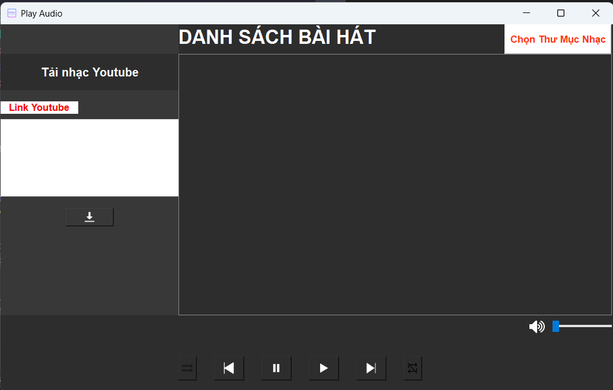

<h2 align="center">Play Audio</h2>
<kbd></kbd>

## Giới thiệu
- **Play Audio là một trình phát nhạc được xây dựng bằng Python sử dụng các thư viện PyQt5, pygame, yt_dlp**

## Cài đặt
- **Cài đặt thư viện bằng pip `pip install <tên thư viện cần cài>`** 
- **Sau đó, clone repository này bằng cách: git clone https://github.com/nmhieu9/OSSD_PlayAudioApp.git**
- **Chạy ứng dụng `python main.py`**

## Chức năng
- **Chọn folder bài hát để phát nhạc**
- **Phát, tạm dừng, chuyển bài hát(next, previous)** 
- **Điều chỉnh âm lượng**
- **Tải xuống file mp3 từ đường dẫn youtube**

## Hướng dẫn sử dụng
1. Tải bài hát từ youtube
 - **Bạn chỉ cần dán liên kết YouTube của bài hát hoặc video muốn tải xuống vào phần mềm. Phần mềm sẽ tự động chuyển đổi video thành tệp âm thanh và tải xuống máy tính.**
